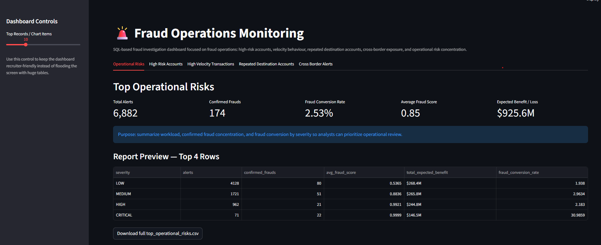
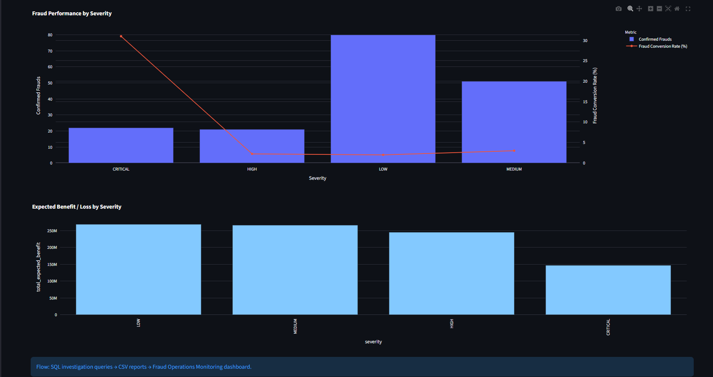
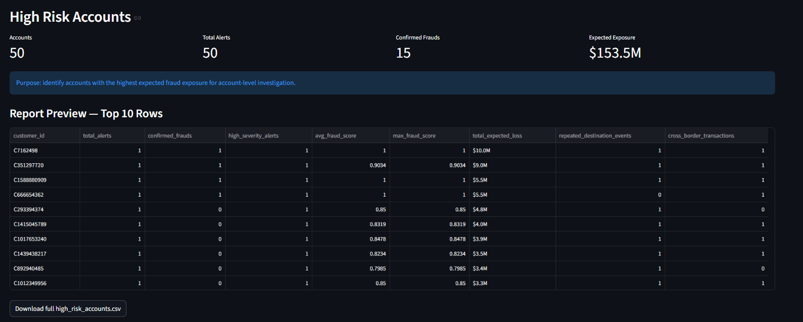
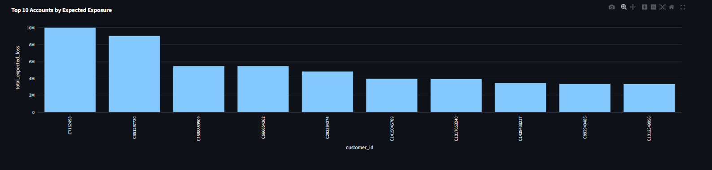
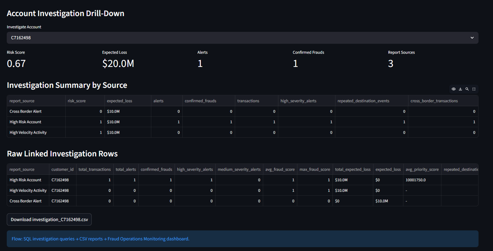
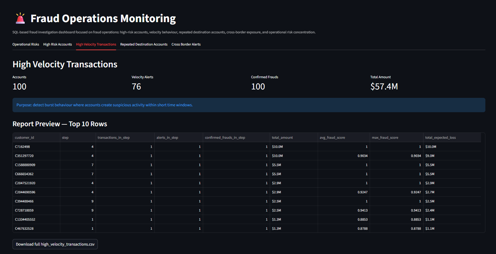
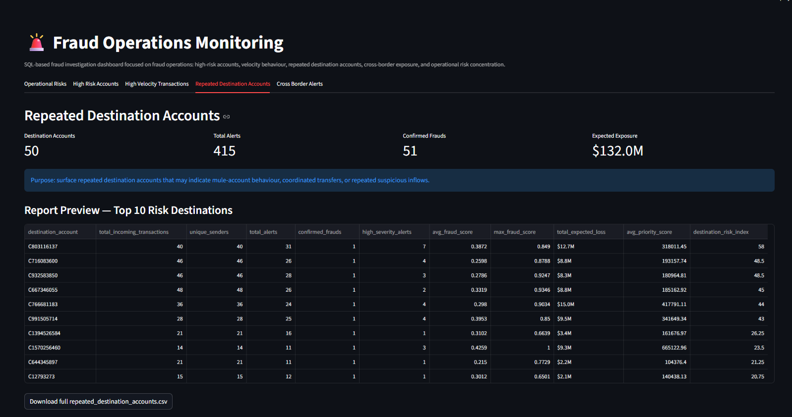
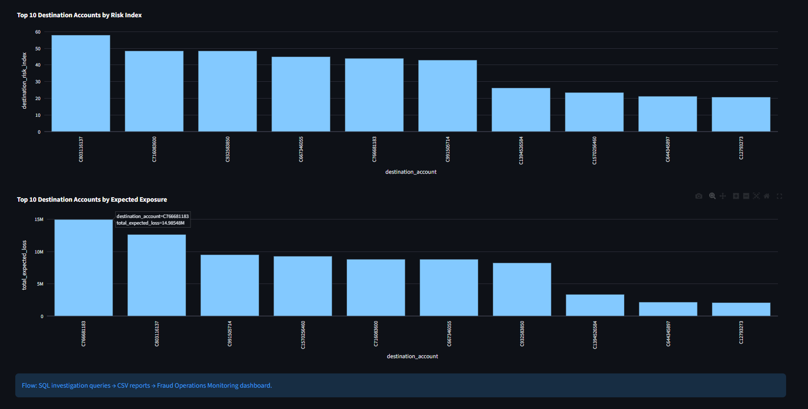
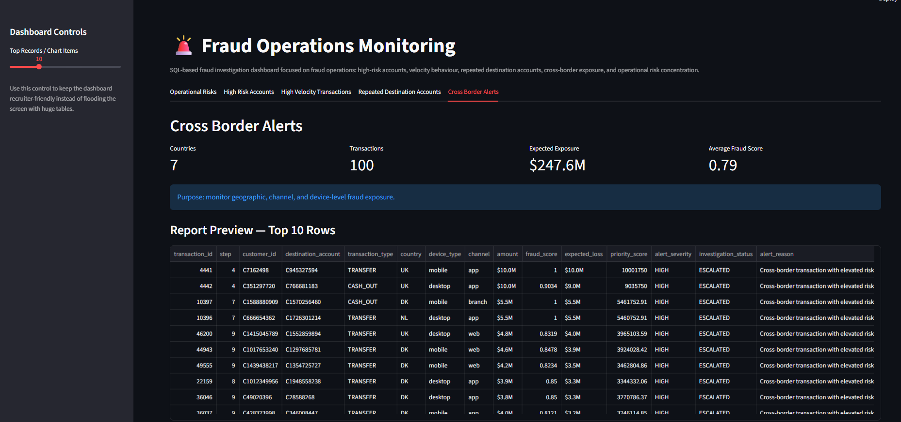
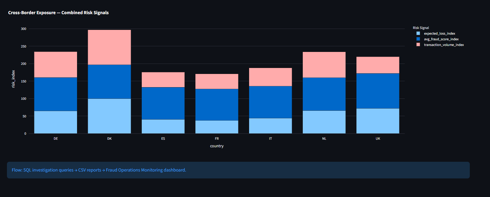

# 🚨 Fraud Investigation Analytics


---

## Overview

Fraud Investigation Analytics is an operational fraud monitoring platform built on SQL investigation reports and an interactive Streamlit dashboard.

Unlike machine learning model repositories that focus on prediction, this project focuses on **fraud operations**, enabling analysts to investigate high-risk accounts, monitor suspicious transaction behaviour, prioritize investigations, and evaluate operational fraud exposure.

This repository demonstrates how SQL investigation queries can be transformed into decision-support dashboards for fraud analysts.

---

## Relationship to the Main Project

This repository is part of the **Adaptive Fraud Intelligence** ecosystem.

**Main Repository**

https://github.com/alice-patrick/adaptive-fraud-intelligence

The main project performs fraud prediction and adaptive decision-making.

This repository focuses on the operational investigation layer built on top of those decision outputs.

---

# Dashboard Features

- Operational Risk Monitoring
- High Risk Account Investigation
- High Velocity Transaction Detection
- Repeated Destination Account Analysis
- Cross-Border Fraud Monitoring
- Interactive Investigation Drill-Down
- Downloadable Investigation Reports
- SQL-powered Fraud Analytics
- Operational KPIs
- Interactive Plotly Visualizations

---

# Dashboard Overview

The main operational dashboard summarizes fraud alerts, confirmed frauds, fraud conversion rate, expected operational benefit, and investigation workload.



---

## Operational Risk Analytics

Interactive visualizations of fraud severity, operational risk concentration, and expected financial benefit.



---

## High Risk Accounts

Identify customer accounts with the highest fraud exposure using operational fraud metrics.



---

## Expected Exposure Ranking

Rank customer accounts by expected financial loss and investigation priority.



---

## Account Investigation Drill-Down

Investigate a customer by combining information from multiple SQL investigation reports into a unified operational view.



---

## High Velocity Transactions

Detect burst transaction behaviour and suspicious account activity occurring within short time windows.



---

## Velocity Analytics

Analyze high-velocity accounts ranked by expected fraud exposure.


---

## Repeated Destination Accounts

Identify destination accounts repeatedly receiving suspicious transfers from multiple customers.



---

## Destination Risk Analytics

Rank destination accounts using a composite destination risk index and expected fraud exposure.



---

## Cross-Border Alerts

Monitor geographically distributed fraud activity using country, channel, device, fraud score, and expected loss indicators.



---

## Cross-Border Risk Analytics

Visualize country-level fraud exposure and combined cross-border risk signals.



---

# Project Structure

```text
fraud-investigation-analytics/
│
├── dashboards/
│   └── fraud_operations_monitoring.py
│
├── sql/
│   ├── top_operational_risks.sql
│   ├── high_risk_accounts.sql
│   ├── high_velocity_transactions.sql
│   ├── repeated_destination_accounts.sql
│   ├── cross_border_alerts.sql
│   ├── precision_recall_at_k.sql
│   ├── operational_cost_performance.sql
│   └── model_decision_performance.sql
│
├── reports/
│
├── scripts/
│   └── run_sql_report.py
│
├── images/
│
├── requirements.txt
│
└── README.md
```

---

# Technology Stack

- Python
- SQL
- SQLite
- Streamlit
- Plotly
- Pandas

---

# Installation

Clone the repository

```bash
git clone https://github.com/alice-patrick/fraud-investigation-analytics.git
```

Move into the project

```bash
cd fraud-investigation-analytics
```

Install dependencies

```bash
pip install -r requirements.txt
```

Launch the dashboard

```bash
streamlit run dashboards/fraud_operations_monitoring.py
```

---

# Project Goals

This project demonstrates how SQL investigation reports can be transformed into a fraud operations dashboard capable of supporting analyst decision-making through interactive visual analytics.

Key objectives include:

- Fraud investigation prioritization
- Operational fraud monitoring
- Investigation workflow support
- Fraud exposure analysis
- SQL-based reporting
- Decision support analytics

---

# Author

**ALIKI Pipitsa**

MSc Artificial Intelligence

University of Essex

---

## License

MIT License
